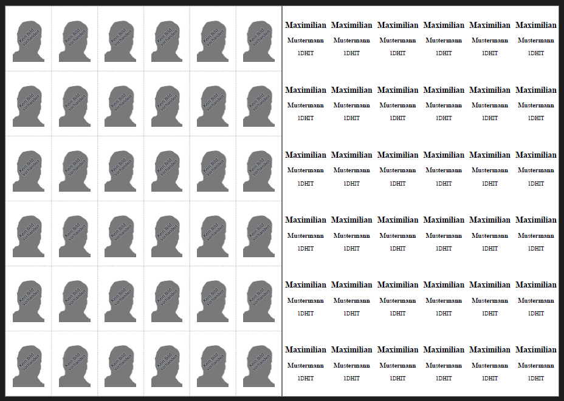

# Result

# Requirements
* Python 3 ([Download](https://www.python.org/downloads/))
  * pandas `pip install pandas`

# Steps
1. Go to [Sokrates](https://www.sokrates-bund.at/SOKB)
2. **Laufendes Schuljahr** -> **Dynamische Suche**  
Select

   1. **100 Aktive Schüler**
   2. **course** (there is no possibility to download all HIT courses at once and downloading all classes exceeds a timeout)
   3. **Tick all fields** or at least **Nummerierung**, **Klasse**, **Schülerkennzahl**, **Familienname** and **Vorname**

3. **Execute**
4. **Select all results** and **export as CSV** 
5. **Run the python script** to convert the CSV to an printable HTML-Page with either of those options:

    * Starting it by **double clicking** opens a file chooser where you can select multiple .csv files (same does `python schuelerlernkartei.py` from command line)
    * From command line run `python schuelerlernkartei.py *` to parse all .csv files within the same directory as the script 
    * From command line run `python schuelerlernkartei.py filename1.csv filename2.csv` to pass the file paths to parse as command line arguments (both relative and absolute paths work)

6. The parsed HTML page gets saved in the same directory as the source file and opened automatically in your default browser.
7. Print on both pages and adjust the scaling in case some text is overflowing a page (should rarely happen and if it does, you can see this on the odd page count)